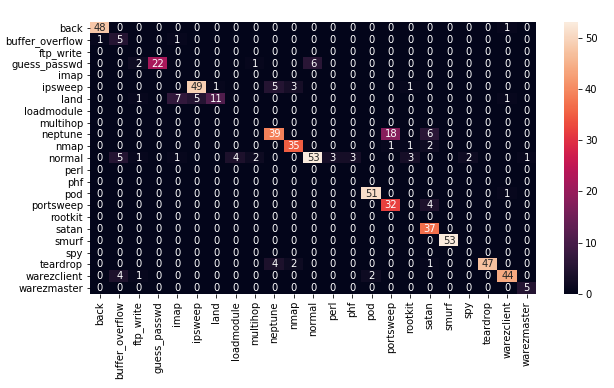

# KNN-Algorithm-KDD-99-Dataset
**K-Nearest Neighbour** algorithm for multiclass classification implemented from scratch without the direct use of algorithm library from sklearn.  
It is tailored as a network intrusion detector, a predictive model capable of distinguishing between bad connections, called intrusions or attacks, and good normal connections.

## Dataset
**KDD Cup 1999 Data**- This database contains a standard set of data to be audited, which includes a wide variety of intrusions simulated in a military network environment.
 
The algorithm was implemeted as a part of the group project - **Network Intrusion Detection System using Data Mining Techniques**.

## Libraries Used

**Numpy**:- It is a fundamental package for scientific computations.  
**Pandas**:- It is a software library for data manipulation and analysis.  
**Matplotlib**:- It is a plotting library in python.  
**Math**:- The Python Math Library provides us access to some common math functions and constants in Python.  
**Sklearn**:- It is used for classification metric calculation as well as confusion matrix evaluation.   
**Seaborn**:- Statistical data visualization.

## Output

